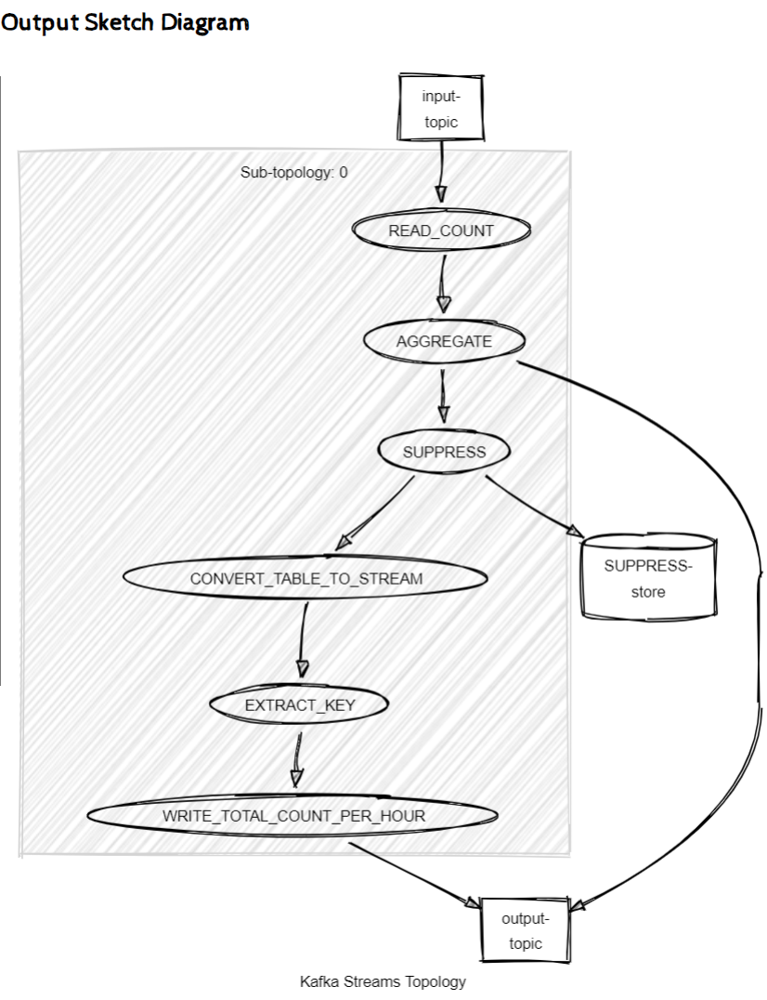

# Big Data Homework

## How to run the application

To run the application you need to have docker and docker-compose installed.
In the main directory (with the docker-compose.yml file) type

```bash
docker-compose up --build
```
After that six components: Zookeper, Kafka, Init-Kafka, Producer, Strams, Consumers should be ready. 
In your docker terminal you should be able to see the logs. There is no need to install java nor kafka. 

Zookeper and Kafka are external components. Init-Kafka provides the means to create initial topics. Our main application consists of three components: Producer, Streams and Consumer.

## Producer 
We expect the end-user to put Clicks and impressions files (parquet) into the _mount/upload_ folder. 
The goal of the producer is to periodically read these files, extract the  
the user agent and the total number of clicks/impressions information,
and send the data into an input topic, e.g.
```
key: some user agent-impressions, value: 4
```
After the messages are successfully sent, the files are moved from the _mount/upload_ to the _mounted/uploaded_ directory,
indicating that the producer has processed the data.

## Streams
Input data are grouped by a key (_groupByKey_) and by one hour window (_windowedBy_). 
Within these groups data are aggregated and the total number of clicks/impressions is being evaluated.
Initially zero and increased with each new record (sum of values).

Then there is a window suppression mechanism. Only the last aggregated value is propagated to the output. 
This effectively allows us to forward only one (last) message per hour.  

At the end there is a simple message conversion. The event kind (e.g. impressions) information is moved from the message 
key to the message value,
so that the key contains only the user-agent (as specified in the requirements).

The total number of clicks/impressions is sent to the output topic, e.g.
```
key: some user agent, value: impressions-10
```


Kafka Streams Topology

### Consumer
The only goal of the consumer is monitoring, to quickly find out what messages had arrived 
to both topics (input-topic and output-topic) and to examine the correctness of the application.
The consumer subscribes to these topics and prints the message content to the _mount/output/output.txt_. 

### Interpretation of results
Below you can find the example file _mount/output/output.txt_

```
topic: input-topic, partition: 7, offset 5, key: some user agent-impressions, value: 4, timestamp 2022-05-26T11:32:12.045Z
topic: input-topic, partition: 7, offset 6, key: some user agent-impressions, value: 7, timestamp 2022-05-26T19:32:04.695Z
topic: input-topic, partition: 7, offset 7, key: some user agent-impressions, value: 3, timestamp 2022-05-26T19:32:04.903Z
topic: input-topic, partition: 0, offset 6, key: some user agent-clicks, value: 5, timestamp 2022-05-27T11:31:45.108Z
topic: input-topic, partition: 0, offset 7, key: some user agent-clicks, value: 5, timestamp 2022-05-27T11:31:45.201Z
topic: input-topic, partition: 0, offset 8, key: some user agent-clicks, value: 7, timestamp 2022-05-27T12:01:43.730Z
topic: input-topic, partition: 0, offset 9, key: some user agent-clicks, value: 3, timestamp 2022-05-27T12:01:43.900Z
topic: input-topic, partition: 7, offset 8, key: some user agent-impressions, value: 4, timestamp 2022-05-27T12:31:54.212Z
topic: input-topic, partition: 7, offset 9, key: some user agent-impressions, value: 6, timestamp 2022-05-27T12:31:54.402Z
topic: input-topic, partition: 0, offset 10, key: some user agent-clicks, value: 7, timestamp 2022-05-27T12:31:54.754Z
topic: input-topic, partition: 0, offset 11, key: some user agent-clicks, value: 3, timestamp 2022-05-27T12:31:54.813Z

topic: output-topic, partition: 7, offset 0, key: some user agent, value: impressions-4, timestamp 2022-05-26T11:32:12.045Z
topic: output-topic, partition: 7, offset 1, key: some user agent, value: clicks-10, timestamp 2022-05-27T11:31:45.201Z
topic: output-topic, partition: 7, offset 2, key: some user agent, value: impressions-10, timestamp 2022-05-26T19:32:04.903Z
```

The file above has been generated by uploading the raw_data content (included in the homework specification) into the application.
The order of the file entries might be different.

You can see there are three output entries.
```
impressions-4, timestamp 2022-05-26T11...
clicks-10, timestamp 2022-05-27T11...
impressions-10, timestamp 2022-05-26T19..
```
and there are five corresponding input events.

```
topic: input-topic, partition: 7, offset 5, key: some user agent-impressions, value: 4, timestamp 2022-05-26T11:32:12.045Z
topic: input-topic, partition: 7, offset 6, key: some user agent-impressions, value: 7, timestamp 2022-05-26T19:32:04.695Z
topic: input-topic, partition: 7, offset 7, key: some user agent-impressions, value: 3, timestamp 2022-05-26T19:32:04.903Z
topic: input-topic, partition: 0, offset 6, key: some user agent-clicks, value: 5, timestamp 2022-05-27T11:31:45.108Z
topic: input-topic, partition: 0, offset 7, key: some user agent-clicks, value: 5, timestamp 2022-05-27T11:31:45.201Z
```
So we can see aggregation (total count) for the following time windows
```
26th 11.00-12.00 
26th 19.00-20.00 
27th 11.00-12.00
```
The last time window 
```
27th 12.00-13.00 
```
has not yet been closed. There still may appear events, so Kafka Streams has not produced a final result yet.
This set of test data has been also been included in the [unit test](streams/src/test/java/org/example/homework/kafka/WindowAggregateTest.java) based on kafka streams test utils library. 
It is easier to test data there, because the unit test executes in millis.


## Configuration

You can configure each module using the following files
- [producer.properties](producer.properties)
- [streams.properties](streams.properties)
- [consumer.properties](consumer.properties)

These include the kafka-producer, kafka-consumer and kafka-streams configuration as well as the application configuration -
specifying the optional user-agent parameter, interval period, window size, topic names, output file path. 

## Author
[Lukasz Gendek](https://www.linkedin.com/in/%C5%82ukasz-gendek-0ba3b0a/)

Note: To run on minikube 
1. type: minikube start --mount-string="$HOME:/hosthome" --mount
2. make ~/upload and ~/uploaded directories to load the intput and read the output data
3. kubectl apply -f .

To continously deliver with argocd follow the tutorial https://spacelift.io/blog/argocd